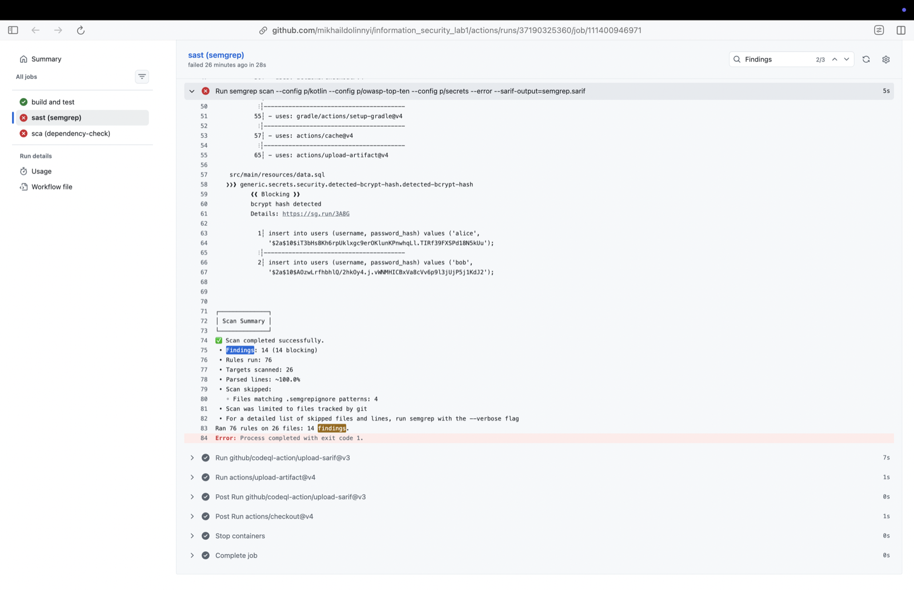
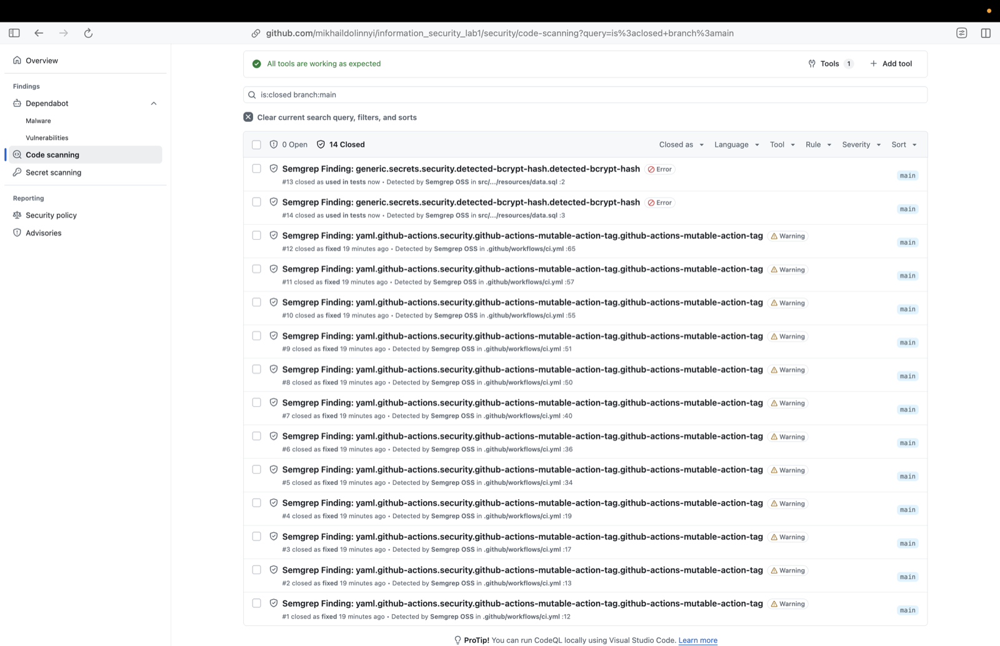
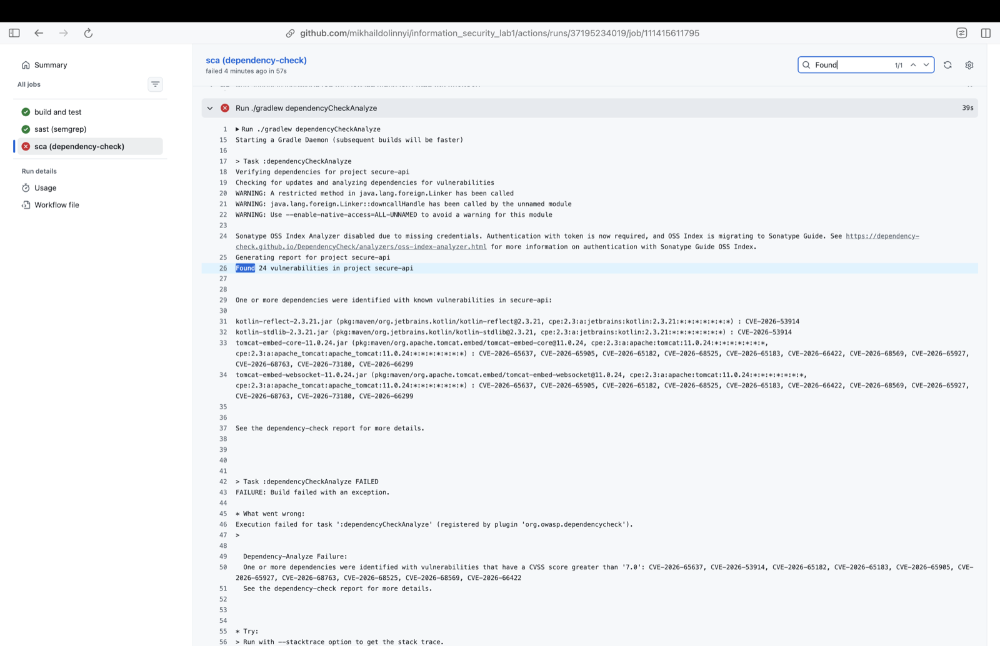
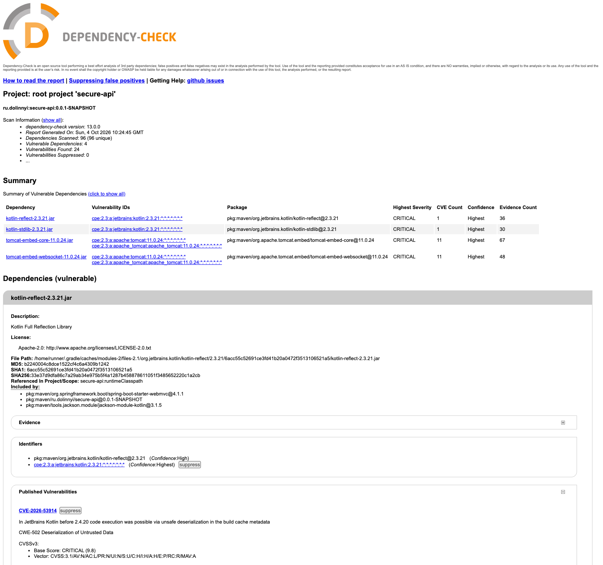
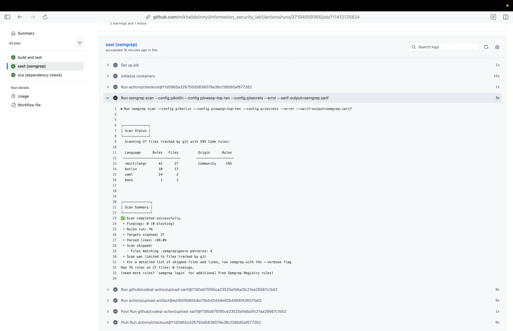
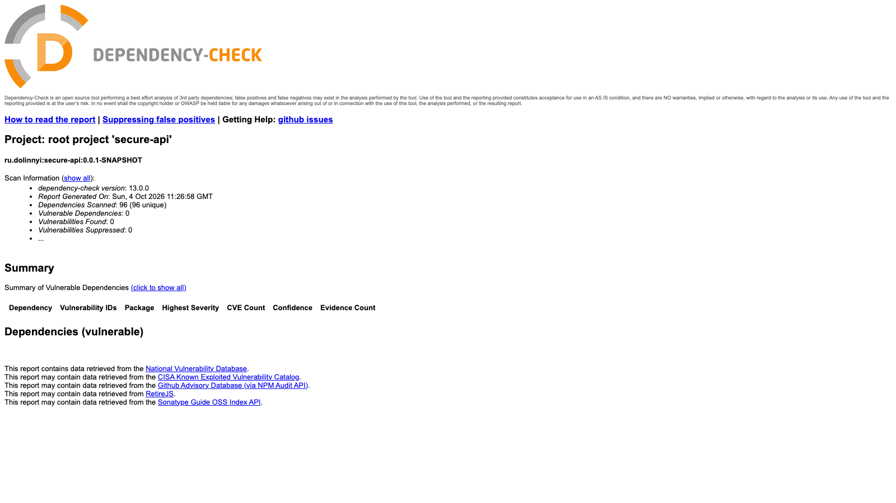
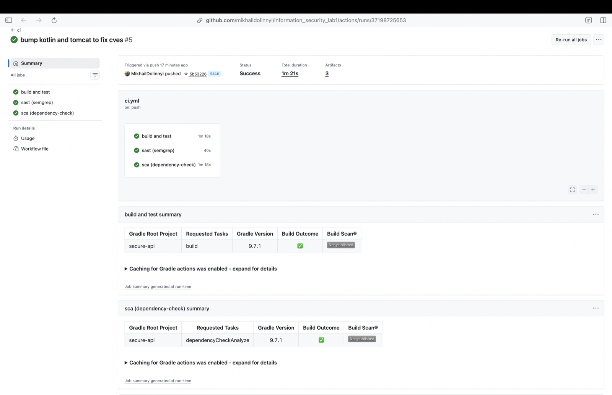

# Secure REST API

Учебный REST API для ЛР1 по дисциплине "Информационная безопасность".
Сервис хранит заметки пользователей. Логин с выдачей JWT, чтение и создание заметок только
с токеном. В проект встроены базовые меры защиты от OWASP Top 10 и CI с проверками SAST и SCA.

Стек: Kotlin 2.4, Spring Boot 4.1 (Web MVC, Security, Data JPA, Validation), H2 в памяти,
jjwt 0.13, Gradle 9.7, Java 21.

## Запуск

```bash
./gradlew bootRun
```

Сервис поднимается на `http://localhost:8080`. База H2 живёт в памяти и пересоздаётся при каждом
старте из `src/main/resources/data.sql`.

Ключ подписи токенов берётся из переменной `JWT_SECRET`. Если её нет,
при старте генерируется случайный ключ, и токены живут до перезапуска.

Тесты:

```bash
./gradlew test
```

Контроллеры покрыты тестами через MockMvc, `JwtService` обычными unit-тестами, всего 16.

Тестовые пользователи: `alice` / `Alice#2026` и `bob` / `Bob#2026`. В базе лежат только
bcrypt-хэши, у alice две стартовые заметки, у bob - одна.

## API

| Метод | Путь | Доступ | Что делает |
|---|---|---|---|
| POST | `/auth/login` | открытый | проверяет логин и пароль, отдаёт JWT |
| GET | `/api/data?q=` | с токеном | список заметок текущего пользователя, `q` фильтрует по заголовку |
| POST | `/api/data` | с токеном | создаёт заметку |

### POST /auth/login

```bash
curl -s -X POST localhost:8080/auth/login \
  -H 'Content-Type: application/json' \
  -d '{"username":"alice","password":"Alice#2026"}'
```

```json
{"token":"eyJhbGciOiJIUzI1NiJ9...","expiresIn":3600,"tokenType":"Bearer"}
```

Неверный пароль и несуществующий логин дают одинаковый ответ с кодом 401, чтобы по нему нельзя
было перебирать имена пользователей:

```json
{"error":"invalid username or password","details":[]}
```

Пустые поля дают 400 с перечнем ошибок валидации.

### GET /api/data

```bash
TOKEN=$(curl -s -X POST localhost:8080/auth/login -H 'Content-Type: application/json' \
  -d '{"username":"alice","password":"Alice#2026"}' | jq -r .token)

curl -s localhost:8080/api/data -H "Authorization: Bearer $TOKEN"
curl -s "localhost:8080/api/data?q=shop" -H "Authorization: Bearer $TOKEN"
```

```json
[{"id":2,"title":"Shopping","content":"milk, bread, coffee","createdAt":"2026-10-04T10:27:41Z"},
 {"id":1,"title":"Welcome","content":"First note, feel free to delete it","createdAt":"2026-10-04T10:27:41Z"}]
```

Без токена, с чужой подписью или с протухшим токеном приходит 401:

```json
{"error":"unauthorized"}
```

### POST /api/data

```bash
curl -s -X POST localhost:8080/api/data \
  -H "Authorization: Bearer $TOKEN" -H 'Content-Type: application/json' \
  -d '{"title":"Lab","content":"<script>alert(1)</script>"}'
```

Ответ 201:

```json
{"id":4,"title":"Lab","content":"&lt;script&gt;alert(1)&lt;/script&gt;","createdAt":"2026-10-04T10:27:44Z"}
```

Ограничения: `title` до 100 символов, `content` до 2000, оба не пустые. Иначе отдаем 400.

## Меры защиты

### SQL-инъекции

Весь доступ к базе идёт через Spring Data JPA. Единственный запрос с пользовательским вводом
это поиск в `NoteRepository.search`:

```kotlin
@Query("""
    select n from Note n
    where n.owner.username = :username
      and lower(n.title) like lower(concat('%', :q, '%'))
    order by n.createdAt desc
""")
fun search(username: String, q: String): List<Note>
```

Параметры `:username` и `:q` уходят в JDBC-драйвер отдельно от текста запроса (prepared
statement), поэтому содержимое `q` не может изменить структуру SQL. Конкатенации строк в запросах
нет нигде. Проверка:

```bash
curl -s -G --data-urlencode "q=' or 1=1 --" localhost:8080/api/data -H "Authorization: Bearer $TOKEN"
# []
```

Это же закреплено тестом `sql injection in search returns nothing`.

### XSS

Единственные данные, которые пользователь пишет сам, это заголовок и текст заметки. При выдаче
они проходят через `HtmlUtils.htmlEscape` в `NoteDtos.kt`:

```kotlin
fun Note.toResponse() = NoteResponse(
    id = requireNotNull(id),
    title = HtmlUtils.htmlEscape(title),
    content = HtmlUtils.htmlEscape(content),
    createdAt = createdAt,
)
```

Символы `< > & " '` заменяются на HTML-сущности, так что даже если клиент вставит поле ответа
в страницу через `innerHTML`, скрипт не выполнится. Плюсом валидация длины на входе,
ответы только с `Content-Type: application/json`, заголовки Spring Security по умолчанию
(`X-Content-Type-Options: nosniff`, `Cache-Control: no-store` и другие). Тест
`html in note is escaped in response`.

### Аутентификация и хранение паролей

Пароли хранятся только в виде bcrypt-хэшей (`BCryptPasswordEncoder`, cost 10). Проверку делает
стандартный `DaoAuthenticationProvider`. Он сравнивает хэши и при несуществующем логине всё равно
считает bcrypt, чтобы время ответа не выдавало, есть ли такой пользователь.

JWT выдаёт `JwtService.issue`: алгоритм HS256, claims `sub`, `iat`, `exp`, время жизни 1 час,
ключ из `JWT_SECRET`. Токен проверяет `JwtAuthFilter` (наследник `OncePerRequestFilter`),
который стоит в цепочке Spring Security перед `UsernamePasswordAuthenticationFilter`:

1. читает заголовок `Authorization: Bearer ...`,
2. проверяет подпись и срок через `JwtService.subjectOf`, при любой ошибке запрос идёт дальше
   без аутентификации и получает 401,
3. загружает пользователя из базы и кладёт его в `SecurityContext`.

Настройки в `SecurityConfig`. Сессии не создаются (stateless), CSRF отключён, так как браузерных
сессий нет и токен передаётся заголовком, открыт только `POST /auth/login`, всё остальное требует
аутентификации, на отказ отдаётся JSON с кодом 401.

Доступ к данным: в каждом запросе к заметкам участвует имя текущего пользователя, поэтому чужие
заметки получить нельзя ни списком, ни поиском. Ошибки отдаются без стектрейсов и внутренних
деталей через общий `ApiExceptionHandler`.

## CI/CD

Workflow `.github/workflows/ci.yml` запускается на каждый push и pull request, три джобы:

| Джоба | Что делает |
|---|---|
| build and test | `./gradlew build`, отчёт по тестам сохраняется артефактом |
| sast (semgrep) | Semgrep с наборами правил `p/kotlin`, `p/owasp-top-ten`, `p/secrets`, флаг `--error` роняет джобу при любой находке, SARIF отправляется во вкладку Security (Code scanning) |
| sca (dependency-check) | OWASP Dependency-Check 13 по `runtimeClasspath`, база NVD по ключу из секрета `NVD_API_KEY` с кэшем между прогонами, порог падения CVSS 7, HTML и JSON отчёт артефактом |

Все actions прибиты к SHA коммита, а не к тегу.

### Что нашли сканеры и что исправлено

Первый прогон Semgrep дал 14 находок:

- 12 раз `github-actions-mutable-action-tag`. Все actions в workflow были подключены по тегу
  вроде `actions/checkout@v4`, который владелец может перевесить на другой коммит. Исправлено
  заменой тегов на SHA коммитов.
- 2 раза `detected-bcrypt-hash` в `data.sql`. Сканер принял хэши тестовых пользователей за
  утёкшие секреты. Это осознанные тестовые данные, строки помечены `nosemgrep` с комментарием,
  алерты закрыты в Code scanning с причиной "Used in tests".





Dependency-Check после настройки нашёл 24 CVE в 4 библиотеках:

- `tomcat-embed-core` и `tomcat-embed-websocket` 11.0.24, которые приходят со Spring Boot 4.1.1:
  11 CVE, среди них критические CVE-2026-65182 (обход security constraint), CVE-2026-65905
  (replay в DIGEST-аутентификации), CVE-2026-68525 (обход ограничения на POST через FORM).
  Все закрыты в 11.0.25, в проекте версия поднята до 11.0.26 через свойство `tomcat.version`.
- `kotlin-stdlib` и `kotlin-reflect` 2.3.21: CVE-2026-53914, небезопасная десериализация в
  build cache Kotlin до 2.4.20. Kotlin обновлён до 2.4.20.





После исправлений все три джобы зелёные:







Последний успешный прогон: https://github.com/MikhailDolinnyi/information_security_lab1/actions/runs/37198725653
